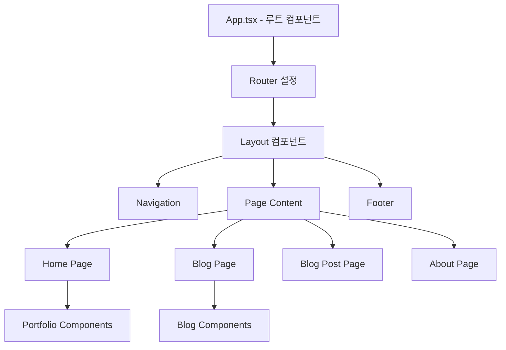

# 🏗️ 포트폴리오 아키텍처 및 코드 흐름 가이드

## 📋 목차
1. [전체 아키텍처 개요](#전체-아키텍처-개요)
2. [프로젝트 구조](#프로젝트-구조)
3. [코드 학습 순서](#코드-학습-순서)
4. [데이터 흐름](#데이터-흐름)
5. [컴포넌트 계층구조](#컴포넌트-계층구조)
6. [라우팅 구조](#라우팅-구조)
7. [스타일링 시스템](#스타일링-시스템)

## 🎯 전체 아키텍처 개요

이 프로젝트는 **React SPA(Single Page Application)** 기반의 모던 개발자 포트폴리오입니다.



## 📁 프로젝트 구조

```
my-portfolio/
├── 📄 설정 파일들
│   ├── package.json              # 의존성 및 스크립트
│   ├── vite.config.ts           # Vite 빌드 도구 설정
│   ├── tailwind.config.js       # Tailwind CSS 설정
│   ├── postcss.config.js        # PostCSS 설정
│   └── tsconfig.json            # TypeScript 설정
│
├── 🎨 소스 코드 (src/)
│   ├── App.tsx                  # 🔥 루트 컴포넌트 (시작점)
│   ├── main.tsx                 # React 앱 엔트리 포인트
│   ├── index.css                # 전역 스타일
│   │
│   ├── 📱 페이지 (pages/)
│   │   ├── Home.tsx             # 메인 포트폴리오 페이지
│   │   ├── Blog.tsx             # 블로그 목록 페이지
│   │   ├── BlogPost.tsx         # 개별 블로그 포스트 페이지
│   │   └── About.tsx            # 상세 소개 페이지
│   │
│   ├── 🧩 컴포넌트 (components/)
│   │   ├── shared/              # 공통 컴포넌트
│   │   │   ├── Layout.tsx       # 전체 레이아웃 래퍼
│   │   │   ├── Navigation.tsx   # 상단 네비게이션
│   │   │   └── Footer.tsx       # 하단 푸터
│   │   │
│   │   ├── portfolio/           # 포트폴리오 섹션
│   │   │   ├── Hero.tsx         # 메인 히어로 섹션
│   │   │   ├── About.tsx        # 자기소개 섹션
│   │   │   ├── Skills.tsx       # 기술 스택 섹션
│   │   │   ├── Projects.tsx     # 프로젝트 섹션
│   │   │   ├── Experience.tsx   # 경력 섹션
│   │   │   └── Contact.tsx      # 연락처 섹션
│   │   │
│   │   └── blog/                # 블로그 관련
│   │       ├── BlogCard.tsx     # 블로그 카드 컴포넌트
│   │       ├── SearchBar.tsx    # 검색 바
│   │       └── TagFilter.tsx    # 태그 필터
│   │
│   ├── 🔧 유틸리티 (utils/)
│   │   └── blogUtils.ts         # 블로그 데이터 관리
│   │
│   └── 📝 타입 정의 (types/)
│       └── blog.ts              # 블로그 관련 TypeScript 타입
│
├── 🌐 정적 자산 (public/)
├── 📚 문서 (docs/)
├── 🚀 배포 스크립트 (scripts/)
└── ⚙️ GitHub Actions (.github/)
```

## 🎓 코드 학습 순서

### Phase 1: 핵심 구조 이해 (필수)
1. **App.tsx** - 애플리케이션의 시작점과 라우팅 구조 파악
2. **Layout.tsx** - 전체 레이아웃 구조 이해
3. **Navigation.tsx** - 네비게이션 로직 및 다크모드 구현

### Phase 2: 페이지 구조 파악
4. **Home.tsx** - 메인 페이지 구성 요소들의 조합
5. **Blog.tsx** - 블로그 목록 페이지의 상태 관리
6. **BlogPost.tsx** - 동적 라우팅과 마크다운 렌더링

### Phase 3: 포트폴리오 컴포넌트들
7. **Hero.tsx** - 메인 히어로 섹션과 애니메이션
8. **About.tsx** - 자기소개 컴포넌트
9. **Skills.tsx** - 진행률 바와 애니메이션
10. **Projects.tsx** - 프로젝트 그리드 레이아웃
11. **Experience.tsx** - 타임라인 컴포넌트
12. **Contact.tsx** - 폼 처리와 상태 관리

### Phase 4: 블로그 시스템
13. **blogUtils.ts** - 블로그 데이터 관리 로직
14. **BlogCard.tsx** - 개별 블로그 카드 컴포넌트
15. **SearchBar.tsx** & **TagFilter.tsx** - 검색 및 필터링

### Phase 5: 설정 및 배포
16. **Tailwind Config** - 커스텀 디자인 시스템
17. **Vite Config** - 빌드 및 개발 서버 설정
18. **GitHub Actions** - 자동 배포 파이프라인

## 🔄 데이터 흐름

### 1. 애플리케이션 초기화
```
main.tsx → App.tsx → HelmetProvider → Router
```

### 2. 페이지 렌더링
```
Router → Layout → Navigation + Page Content + Footer
```

### 3. 블로그 데이터 흐름
```
blogUtils.ts → Blog.tsx → useState → BlogCard.tsx
                ↓
            SearchBar & TagFilter → 필터링된 데이터
```

### 4. 다크모드 상태 관리
```
Navigation.tsx → localStorage → CSS 클래스 토글 → 전역 적용
```

## 🏗️ 컴포넌트 계층구조

```
App
├── HelmetProvider (SEO 관리)
└── Router
    └── Layout
        ├── Navigation (고정 헤더)
        ├── main (페이지 콘텐츠)
        │   ├── Home
        │   │   ├── Hero
        │   │   ├── About
        │   │   ├── Skills
        │   │   ├── Projects
        │   │   ├── Experience
        │   │   └── Contact
        │   ├── Blog
        │   │   ├── SearchBar
        │   │   ├── TagFilter
        │   │   └── BlogCard[]
        │   ├── BlogPost
        │   └── About (상세)
        └── Footer
```

## 🛣️ 라우팅 구조

| 경로 | 컴포넌트 | 설명 |
|------|----------|------|
| `/` | Home | 메인 포트폴리오 페이지 |
| `/blog` | Blog | 블로그 목록 |
| `/blog/:slug` | BlogPost | 개별 블로그 포스트 |
| `/about` | About | 상세 자기소개 |

## 🎨 스타일링 시스템

### 1. Tailwind CSS 기반
- **유틸리티 퍼스트**: 빠른 개발을 위한 클래스 기반 스타일링
- **커스텀 디자인 토큰**: 색상, 폰트, 애니메이션 등 일관된 디자인

### 2. 커스텀 CSS 컴포넌트 (`src/index.css`)
- **gradient-text**: 그라데이션 텍스트 효과
- **glass-effect**: 글래스모피즘 효과
- **hover-lift**: 호버 애니메이션

### 3. Framer Motion 애니메이션
- **페이지 전환**: 부드러운 페이지 이동
- **요소 애니메이션**: 스크롤 기반 애니메이션
- **인터랙티브 효과**: 호버, 클릭 피드백

## 🔧 핵심 기술 스택 연결점

### React + TypeScript
- **타입 안전성**: 모든 컴포넌트와 함수에 타입 정의
- **Props 인터페이스**: 컴포넌트 간 데이터 전달 명세

### Vite + PostCSS + Tailwind
- **개발 환경**: 빠른 핫 리로드와 번들링
- **CSS 처리**: PostCSS를 통한 Tailwind 컴파일
- **최적화**: 프로덕션 빌드 시 자동 최적화

### React Router + Helmet
- **SPA 라우팅**: 페이지 간 네비게이션
- **SEO 최적화**: 동적 메타태그 관리

## 🚀 개발 워크플로우

1. **로컬 개발**: `npm run dev` → http://localhost:5173
2. **빌드 테스트**: `npm run build` → dist/ 폴더 생성
3. **배포**: GitHub push → Actions → AWS S3 배포

## 📚 학습 팁

1. **시작점**: `App.tsx`에서 전체 구조를 먼저 파악하세요
2. **컴포넌트 분석**: 각 컴포넌트의 props와 상태를 중심으로 이해하세요
3. **스타일링**: Tailwind 클래스와 커스텀 CSS의 조합을 관찰하세요
4. **애니메이션**: Framer Motion의 선언적 애니메이션 패턴을 학습하세요
5. **타입스크립트**: 인터페이스와 타입 정의를 통해 데이터 구조를 파악하세요

---

이 가이드를 따라 학습하시면 전체 코드베이스를 효율적으로 이해할 수 있습니다!