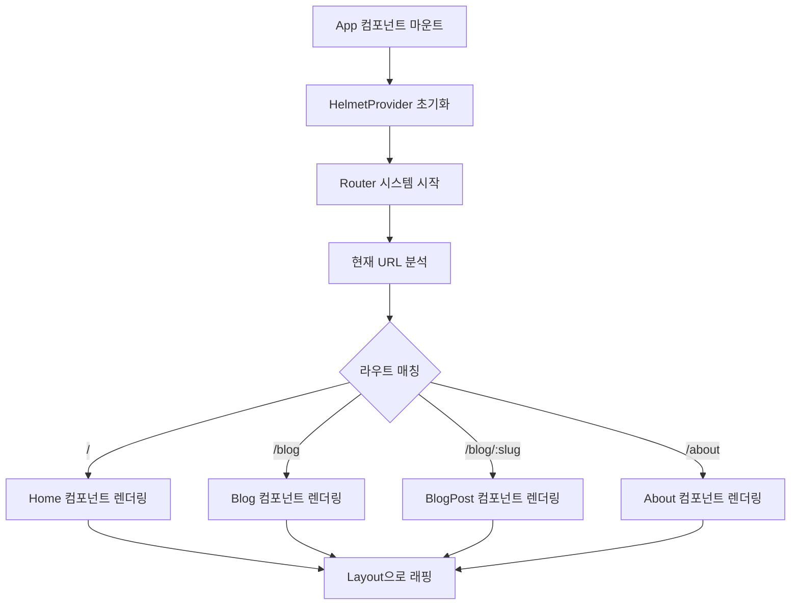

# 📱 App.tsx - 애플리케이션 루트 컴포넌트

## 🎯 목적
전체 애플리케이션의 진입점으로, 라우팅 구조와 전역 설정을 담당합니다.

## 📍 위치
`src/App.tsx`

## 🔍 코드 분석

```typescript
import { BrowserRouter as Router, Routes, Route } from 'react-router-dom';
import { HelmetProvider } from 'react-helmet-async';
import Layout from './components/shared/Layout';
import Home from './pages/Home';
import Blog from './pages/Blog';
import BlogPost from './pages/BlogPost';
import About from './pages/About';

function App() {
  return (
    <HelmetProvider>      {/* SEO 메타태그 관리 */}
      <Router>            {/* SPA 라우팅 시스템 */}
        <Layout>          {/* 공통 레이아웃 래퍼 */}
          <Routes>
            <Route path="/" element={<Home />} />
            <Route path="/blog" element={<Blog />} />
            <Route path="/blog/:slug" element={<BlogPost />} />
            <Route path="/about" element={<About />} />
          </Routes>
        </Layout>
      </Router>
    </HelmetProvider>
  );
}
```

## 🧩 주요 구성 요소

### 1. HelmetProvider
- **목적**: SEO와 메타태그 관리
- **기능**: 각 페이지별로 동적으로 `<head>` 태그 내용 변경
- **사용법**: 하위 컴포넌트에서 `<Helmet>` 사용 가능

### 2. BrowserRouter (Router)
- **목적**: SPA 라우팅 시스템 제공
- **특징**: HTML5 History API 사용
- **URL 형태**: `/`, `/blog`, `/blog/post-slug`

### 3. Layout 컴포넌트
- **역할**: 모든 페이지 공통 레이아웃
- **포함 요소**: Navigation, Footer, 메인 콘텐츠 래퍼

### 4. Routes와 Route
- **동적 라우팅**: `:slug` 파라미터로 블로그 포스트 동적 라우팅
- **컴포넌트 매핑**: 각 경로별 렌더링할 컴포넌트 지정

## 🔄 데이터 흐름



## 🎨 주요 특징

### 1. 선언적 라우팅
```typescript
// 명시적이고 읽기 쉬운 라우트 정의
<Route path="/blog/:slug" element={<BlogPost />} />
```

### 2. 중첩 구조
```typescript
// 모든 페이지가 Layout으로 감싸짐
<Layout>
  <Routes>...</Routes>
</Layout>
```

### 3. SEO 준비
```typescript
// 모든 하위 컴포넌트에서 SEO 설정 가능
<HelmetProvider>
```

## 🛠️ 개발 팁

### 1. 새로운 페이지 추가
```typescript
// 1. 페이지 컴포넌트 import
import NewPage from './pages/NewPage';

// 2. Route 추가
<Route path="/new-page" element={<NewPage />} />
```

### 2. 중첩 라우팅 (필요시)
```typescript
// 서브 라우트가 필요한 경우
<Route path="/blog/*" element={<BlogLayout />}>
  <Route path="category/:category" element={<BlogCategory />} />
</Route>
```

### 3. 보호된 라우트 (인증 필요)
```typescript
// 인증이 필요한 페이지의 경우
<Route path="/admin" element={
  <ProtectedRoute>
    <AdminPage />
  </ProtectedRoute>
} />
```

## 🔗 연결된 컴포넌트

### 상위 컴포넌트
- `main.tsx` (React 앱 진입점)

### 하위 컴포넌트
- **Layout**: 공통 레이아웃
- **Home**: 메인 포트폴리오 페이지
- **Blog**: 블로그 목록 페이지
- **BlogPost**: 개별 블로그 포스트
- **About**: 상세 소개 페이지

## 📚 학습 포인트

1. **SPA 라우팅 개념**: React Router의 선언적 라우팅
2. **컴포넌트 합성**: Provider 패턴을 통한 전역 기능 제공
3. **코드 분할**: 페이지별 컴포넌트 분리
4. **SEO 전략**: SPA에서의 메타태그 관리

## 🚀 확장 가능성

- **국제화 (i18n)**: 다국어 지원 Provider 추가
- **상태 관리**: Redux/Zustand Provider 추가
- **테마 시스템**: ThemeProvider로 글로벌 테마 관리
- **에러 바운더리**: 전역 에러 처리 시스템

---

**다음 학습**: `Layout.tsx`로 이동하여 공통 레이아웃 구조 파악