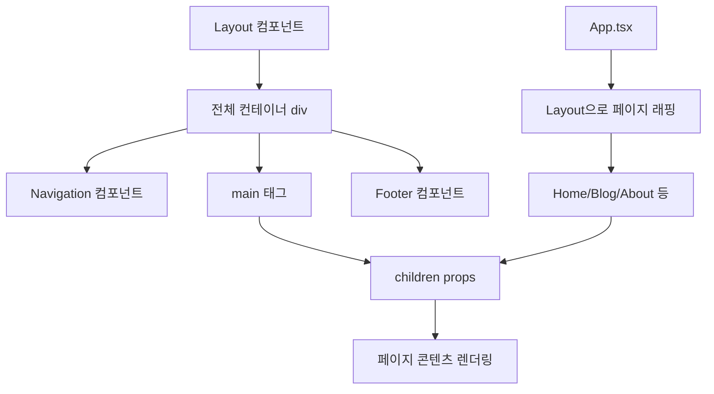

# 🏗️ Layout.tsx - 전체 레이아웃 컴포넌트

## 🎯 목적
모든 페이지의 공통 레이아웃을 제공하며, Navigation과 Footer를 포함하는 래퍼 컴포넌트입니다.

## 📍 위치
`src/components/shared/Layout.tsx`

## 🔍 코드 분석

```typescript
import type { ReactNode } from 'react';
import Navigation from './Navigation';
import Footer from './Footer';

interface LayoutProps {
  children: ReactNode;  // 페이지 콘텐츠를 받음
}

const Layout = ({ children }: LayoutProps) => {
  return (
    <div className="min-h-screen bg-gray-50 dark:bg-gray-900 transition-colors">
      <Navigation />
      <main className="pt-16">    {/* Navigation 높이만큼 패딩 */}
        {children}               {/* 페이지별 콘텐츠 */}
      </main>
      <Footer />
    </div>
  );
};
```

## 🧩 주요 구성 요소

### 1. TypeScript 인터페이스
```typescript
interface LayoutProps {
  children: ReactNode;  // React 컴포넌트나 JSX 요소
}
```
- **ReactNode**: React에서 렌더링 가능한 모든 타입
- **children**: 페이지 컴포넌트들이 전달됨

### 2. 컨테이너 구조
```typescript
<div className="min-h-screen bg-gray-50 dark:bg-gray-900 transition-colors">
```
- **min-h-screen**: 최소 화면 높이 100vh
- **다크모드 지원**: `dark:` 접두사로 다크 테마 색상
- **transition-colors**: 부드러운 색상 전환 애니메이션

### 3. 네비게이션 영역
```typescript
<Navigation />
<main className="pt-16">
```
- **고정 헤더**: Navigation은 `fixed` 포지션
- **pt-16**: 고정 헤더 높이만큼 메인 콘텐츠에 상단 패딩

## 🎨 CSS 클래스 분석

### 다크모드 구현
```css
/* 라이트 모드 */
bg-gray-50

/* 다크 모드 (dark 클래스가 html에 적용될 때) */
dark:bg-gray-900
```

### 반응형 레이아웃
```css
/* 전체 화면 높이 확보 */
min-h-screen

/* 색상 변경 시 부드러운 전환 */
transition-colors
```

## 🔄 컴포넌트 흐름



## 🏗️ 레이아웃 구조

```
┌─────────────────────────────────┐
│         Navigation              │  ← 고정 헤더 (z-50)
├─────────────────────────────────┤
│                                 │
│        페이지 콘텐츠              │  ← pt-16으로 헤더 아래 시작
│        (children)               │
│                                 │
│                                 │
├─────────────────────────────────┤
│         Footer                  │  ← 페이지 하단
└─────────────────────────────────┘
```

## 🎯 설계 원칙

### 1. 컴포지션 패턴
```typescript
// children props를 통해 내용을 주입받음
const Layout = ({ children }: LayoutProps) => {
  return (
    <div>
      <Header />
      {children}    {/* 여기에 페이지별 내용이 들어감 */}
      <Footer />
    </div>
  );
};
```

### 2. 관심사의 분리
- **Layout**: 전체 구조만 담당
- **Navigation**: 헤더 로직 분리
- **Footer**: 푸터 로직 분리
- **Pages**: 콘텐츠만 집중

### 3. 일관성 보장
- 모든 페이지가 동일한 레이아웃 구조 사용
- 헤더/푸터가 항상 동일한 위치에 표시

## 🛠️ 사용 예시

### App.tsx에서의 사용
```typescript
<Layout>
  <Routes>
    <Route path="/" element={<Home />} />
    <Route path="/blog" element={<Blog />} />
  </Routes>
</Layout>
```

### 개별 페이지에서의 렌더링
```typescript
// Home 컴포넌트가 children으로 전달됨
const Home = () => {
  return (
    <div>
      <Hero />
      <About />
      <Projects />
    </div>
  );
};
```

## 🔧 커스터마이징 포인트

### 1. 레이아웃 변형
```typescript
// 다른 레이아웃이 필요한 경우
interface LayoutProps {
  children: ReactNode;
  variant?: 'default' | 'fullscreen' | 'minimal';
}

const Layout = ({ children, variant = 'default' }: LayoutProps) => {
  if (variant === 'fullscreen') {
    return <div className="min-h-screen">{children}</div>;
  }
  
  // 기본 레이아웃
  return (/* ... */);
};
```

### 2. 조건부 헤더/푸터
```typescript
interface LayoutProps {
  children: ReactNode;
  showHeader?: boolean;
  showFooter?: boolean;
}

const Layout = ({ 
  children, 
  showHeader = true, 
  showFooter = true 
}: LayoutProps) => {
  return (
    <div className="min-h-screen">
      {showHeader && <Navigation />}
      <main className={showHeader ? "pt-16" : ""}>
        {children}
      </main>
      {showFooter && <Footer />}
    </div>
  );
};
```

## 🔗 연결된 컴포넌트

### 부모 컴포넌트
- **App.tsx**: Layout을 사용하여 모든 페이지 래핑

### 자식 컴포넌트
- **Navigation.tsx**: 상단 네비게이션
- **Footer.tsx**: 하단 푸터

### 페이지 컴포넌트들 (children으로 전달)
- **Home.tsx**
- **Blog.tsx**
- **BlogPost.tsx**
- **About.tsx**

## 📚 학습 포인트

1. **컴포지션 패턴**: children props를 통한 유연한 구조
2. **타입스크립트**: ReactNode 타입과 인터페이스 정의
3. **CSS 레이아웃**: 고정 헤더와 메인 콘텐츠 배치
4. **다크모드**: CSS 클래스를 통한 테마 전환
5. **컴포넌트 분리**: 단일 책임 원칙 적용

## 🚀 확장 아이디어

- **사이드바 추가**: 데스크톱에서 사이드 네비게이션
- **브레드크럼**: 현재 위치 표시
- **스크롤 진행바**: 페이지 스크롤 진행률
- **백 투 탑**: 페이지 상단으로 이동 버튼

---

**다음 학습**: `Navigation.tsx`로 이동하여 헤더 로직과 다크모드 구현 파악