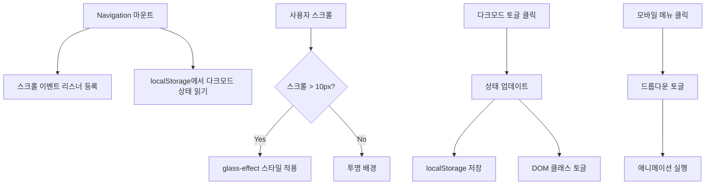

# 🧭 Navigation.tsx - 네비게이션 컴포넌트

## 🎯 목적
상단 고정 네비게이션 바로, 라우팅, 다크모드 토글, 모바일 메뉴 등의 핵심 기능을 담당합니다.

## 📍 위치
`src/components/shared/Navigation.tsx`

## 🔍 코드 구조 분석

### 1. Import 및 상태 관리
```typescript
import { useState, useEffect } from 'react';
import { Link, useLocation } from 'react-router-dom';
import { motion } from 'framer-motion';

const Navigation = () => {
  const [isScrolled, setIsScrolled] = useState(false);      // 스크롤 상태
  const [isMobileMenuOpen, setIsMobileMenuOpen] = useState(false);  // 모바일 메뉴
  const [isDarkMode, setIsDarkMode] = useState(false);      // 다크모드
  const location = useLocation();  // 현재 경로 감지
```

### 2. 스크롤 감지 로직
```typescript
useEffect(() => {
  const handleScroll = () => {
    setIsScrolled(window.scrollY > 10);  // 10px 이상 스크롤 시
  };

  window.addEventListener('scroll', handleScroll);
  return () => window.removeEventListener('scroll', handleScroll);
}, []);
```

### 3. 다크모드 초기화 및 토글
```typescript
// 페이지 로드 시 localStorage에서 다크모드 상태 복원
useEffect(() => {
  const darkMode = localStorage.getItem('darkMode') === 'true';
  setIsDarkMode(darkMode);
  if (darkMode) {
    document.documentElement.classList.add('dark');
  }
}, []);

// 다크모드 토글 함수
const toggleDarkMode = () => {
  const newDarkMode = !isDarkMode;
  setIsDarkMode(newDarkMode);
  localStorage.setItem('darkMode', String(newDarkMode));
  document.documentElement.classList.toggle('dark');
};
```

## 🎨 스타일링 시스템

### 1. 동적 배경 (스크롤 기반)
```typescript
const navClass = `fixed top-0 w-full z-50 transition-all duration-300 ${
  isScrolled ? 'glass-effect shadow-lg' : 'bg-transparent'
}`;
```
- **스크롤 전**: 투명한 배경
- **스크롤 후**: 글래스모피즘 효과 + 그림자

### 2. 활성 링크 표시
```typescript
const linkClass = `relative px-3 py-2 text-sm font-medium transition-colors ${
  location.pathname === link.path
    ? 'text-primary dark:text-primary-dark'
    : 'text-gray-700 dark:text-gray-300 hover:text-primary'
}`;
```

### 3. 애니메이션된 인디케이터
```typescript
{location.pathname === link.path && (
  <motion.div
    className="absolute bottom-0 left-0 right-0 h-0.5 bg-primary"
    layoutId="navbar-indicator"  // Framer Motion의 레이아웃 애니메이션
  />
)}
```

## 🧩 주요 기능 구현

### 1. 네비게이션 링크 데이터
```typescript
const navLinks = [
  { path: '/', label: 'Home' },
  { path: '/blog', label: 'Blog' },
  { path: '/about', label: 'About' },
];
```

### 2. 데스크톱 네비게이션
```typescript
<div className="hidden md:flex items-center space-x-8">
  {navLinks.map((link) => (
    <Link key={link.path} to={link.path} className={linkClass}>
      {link.label}
      {/* 활성 상태 인디케이터 */}
    </Link>
  ))}
  <DarkModeButton />
</div>
```

### 3. 모바일 햄버거 메뉴
```typescript
<button
  onClick={() => setIsMobileMenuOpen(!isMobileMenuOpen)}
  className="md:hidden p-2 rounded-lg hover:bg-gray-200"
>
  <svg className="w-6 h-6">
    {isMobileMenuOpen ? (
      <path d="M6 18L18 6M6 6l12 12" />  // X 아이콘
    ) : (
      <path d="M4 6h16M4 12h16M4 18h16" />  // 햄버거 아이콘
    )}
  </svg>
</button>
```

### 4. 모바일 드롭다운 메뉴
```typescript
{isMobileMenuOpen && (
  <motion.div
    initial={{ opacity: 0, y: -20 }}
    animate={{ opacity: 1, y: 0 }}
    exit={{ opacity: 0, y: -20 }}
    className="md:hidden py-4 border-t"
  >
    {/* 모바일 링크들 */}
  </motion.div>
)}
```

## 🔄 상태 흐름도



## 🎯 핵심 패턴 분석

### 1. Custom Hooks 패턴 (개선 가능)
현재는 컴포넌트 내부에 로직이 있지만, 커스텀 훅으로 분리 가능:

```typescript
// useNavigation.ts (개선안)
const useNavigation = () => {
  const [isScrolled, setIsScrolled] = useState(false);
  const [isMobileMenuOpen, setIsMobileMenuOpen] = useState(false);
  
  // 스크롤 감지 로직...
  
  return { isScrolled, isMobileMenuOpen, setIsMobileMenuOpen };
};
```

### 2. 조건부 렌더링 패턴
```typescript
// 조건에 따라 다른 UI 렌더링
{isDarkMode ? <SunIcon /> : <MoonIcon />}
{isMobileMenuOpen ? <CloseIcon /> : <HamburgerIcon />}
```

### 3. 이벤트 리스너 정리 패턴
```typescript
useEffect(() => {
  const handleScroll = () => setIsScrolled(window.scrollY > 10);
  
  window.addEventListener('scroll', handleScroll);
  return () => window.removeEventListener('scroll', handleScroll);  // 정리
}, []);
```

## 🛠️ 반응형 디자인

### 데스크톱 (md: 이상)
- 수평 네비게이션 링크 표시
- 다크모드 토글 버튼
- 호버 효과

### 모바일 (md 미만)
- 햄버거 메뉴 버튼
- 드롭다운 메뉴
- 터치 친화적 버튼 크기

## 🎨 애니메이션 구현

### 1. Framer Motion 레이아웃 애니메이션
```typescript
<motion.div
  className="absolute bottom-0 left-0 right-0 h-0.5 bg-primary"
  layoutId="navbar-indicator"  // 같은 ID를 가진 요소 간 부드러운 전환
/>
```

### 2. 모바일 메뉴 애니메이션
```typescript
<motion.div
  initial={{ opacity: 0, y: -20 }}    // 시작 상태
  animate={{ opacity: 1, y: 0 }}      // 애니메이션 종료 상태
  exit={{ opacity: 0, y: -20 }}       // 제거 시 애니메이션
>
```

## 🔧 커스터마이징 가이드

### 1. 네비게이션 링크 추가
```typescript
const navLinks = [
  { path: '/', label: 'Home' },
  { path: '/blog', label: 'Blog' },
  { path: '/portfolio', label: 'Portfolio' },  // 새 링크 추가
  { path: '/about', label: 'About' },
];
```

### 2. 로고 추가
```typescript
<Link to="/" className="flex items-center space-x-2">
  
  <span className="text-2xl font-bold gradient-text">Portfolio</span>
</Link>
```

### 3. 스크롤 threshold 조정
```typescript
// 스크롤 감지 지점 변경 (현재 10px)
setIsScrolled(window.scrollY > 50);  // 50px로 변경
```

## 🔗 연결된 컴포넌트

### 부모 컴포넌트
- **Layout.tsx**: Navigation을 포함

### 사용하는 라이브러리
- **react-router-dom**: Link, useLocation
- **framer-motion**: 애니메이션 효과

### 관련 스타일
- **index.css**: `.glass-effect`, `.gradient-text` 클래스

## 📚 학습 포인트

1. **React Hooks**: useState, useEffect 활용
2. **이벤트 처리**: 스크롤, 클릭 이벤트 관리
3. **localStorage**: 브라우저 저장소 활용
4. **조건부 렌더링**: 상태에 따른 UI 변경
5. **반응형 디자인**: Tailwind CSS 브레이크포인트
6. **애니메이션**: Framer Motion 기본 사용법
7. **접근성**: aria-label, 키보드 네비게이션 고려

## 🚀 확장 아이디어

- **검색 기능**: 네비게이션에 검색 바 추가
- **알림 시스템**: 새 블로그 포스트 알림
- **다국어 지원**: 언어 전환 버튼
- **사용자 메뉴**: 로그인/프로필 드롭다운

---

**다음 학습**: `Footer.tsx`로 이동하여 푸터 구조 파악 후 포트폴리오 컴포넌트들 학습